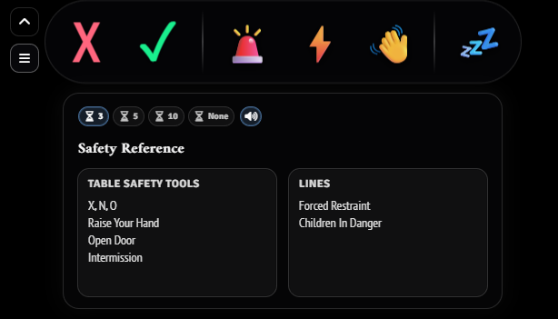
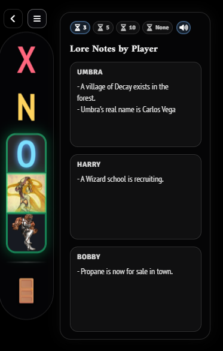

### Horizontal Toolbar

# Safety and Communication

Safety and Communication is a compact, system-agnostic Foundry VTT module for keeping table safety and lightweight participation signals visible during play. It gives GMs and players a dockable toolbar for X/N/O style safety signals, hand-raising order, AFK/Open Door presence states, participant/source tiles, and an editable Safety Reference drawer for table rules, Lines, Veils, and safety procedures.

## Screenshots

### Horizontal Toolbar

### Horizontal Toolbar with Reference Drawer

### Vertical Toolbar with Reference Drawer

## Package Information

| Field | Value |
| --- | --- |
| Module Name | Safety and Communication |
| Version | 1.0.0 |
| Foundry Compatibility | Minimum 13, verified 14 |
| System Compatibility | System-agnostic |
| Module Code License | All Rights Reserved |
| Audio Attribution | Kenney Interface Sounds, CC0 |

## Features

- X/N/O safety tools with configurable anonymous presentation options.
- Hand-raising tools: Cut in Line, Next In Line, and Back of the Line.
- Presence tools: AFK and Open Door.
- Participant/source tiles for visible safety, hand, and presence signals.
- Client-side toolbar placement, docking, resizing, and initial open/closed preference.
- Editable Safety Reference drawer with inline title and box editing.
- Collapsed-toolbar notification timer controls.
- Optional notification sounds, including priority X Card sound behavior.

## Compatibility

- Minimum Foundry VTT version: 13
- Verified Foundry VTT version: 14
- System compatibility: system-agnostic

## Use Notes

- Anonymous safety signals never show participant portraits.
- Safety Reference boxes are plain multiline text. Markdown and rich text formatting are not included in this release.
- This module is a communication aid. It does not replace a table's safety policy, consent discussion, or Session 0 expectations.
- Chat output, macro slots, emergency pause, and Help Mode are not included in this release.

## License

Module code and original module content are © 2026 Zenfyre. All Rights Reserved. See `LICENSE.md`.

## Audio Attribution

Bundled audio assets are sourced from Kenney Interface Sounds under Creative Commons Zero (CC0). See `ATTRIBUTION.md` and `LICENSE-KENNEY-INTERFACE-SOUNDS.txt`.
